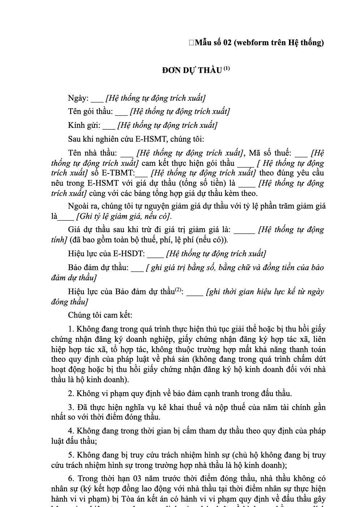
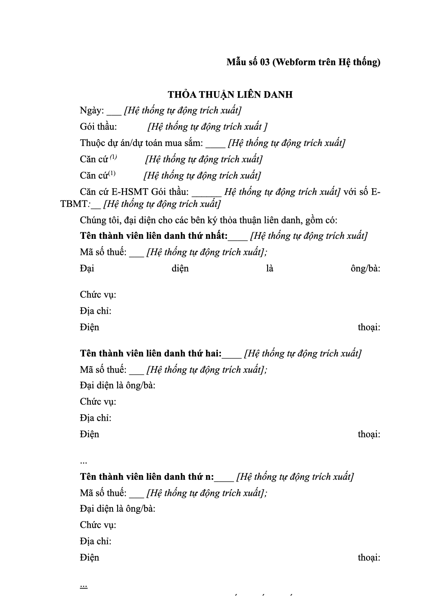
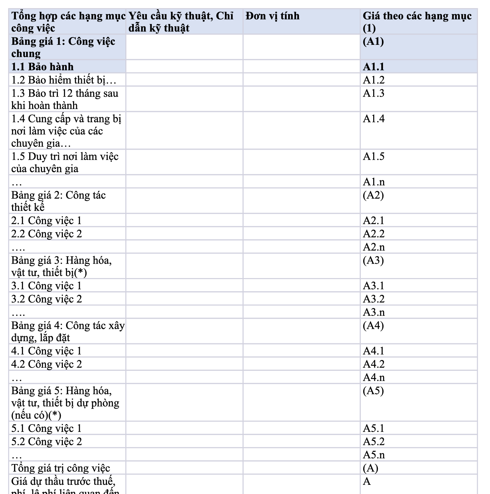

# hsdt-forms

Bộ **biểu mẫu Hồ sơ dự thầu (HSDT / E-HSDT)** đúng chuẩn **Thông tư 79/2025/TT-BTC** — tách nguyên trạng
từ E-HSMT mẫu do Bộ Tài chính ban hành, kèm công cụ tách biểu mẫu cho **mọi loại gói thầu**.

> ⚠️ **Không phải biểu mẫu NĐ 30**. HSDT không dùng thể thức văn bản hành chính:
> không có `Số: …/…-HSDT`, không có `Hà Nội, ngày …`, không có khối tiêu đề 2 cột.
> Đầu biểu mẫu là `Mẫu số 02 (webform trên Hệ thống)` — căn phải, đậm, 14 pt.

---

## Bộ có sẵn — dùng ngay, không cần cài gì

| Bộ | Loại gói thầu | Word | Excel | Thư mục |
|:--|:--|--:|--:|:--|
| `EPC-10A` | EPC — thiết kế, cung cấp hàng hóa và xây lắp | 32 | 30 | `templates/EPC-10A/` |
| `Xay-lap-3A` | Xây lắp | 25 | 22 | `templates/Xay-lap-3A/` |
| `Hang-hoa-4A` | Mua sắm hàng hóa | 32 | 29 | `templates/Hang-hoa-4A/` |
| `EC-8A` | EC — thiết kế và xây lắp | 26 | 23 | `templates/EC-8A/` |
| `PC-9A` | PC — cung cấp hàng hóa và xây lắp | 35 | 32 | `templates/PC-9A/` |

```text
templates/EPC-10A/          ← 32 biểu mẫu HSDT gói EPC (Chương IV, Mẫu số 10A)
├── TT79-M02.docx             Đơn dự thầu
├── TT79-M03.docx             Thỏa thuận liên danh
├── TT79-M04A.docx / 04B.docx Bảo lãnh dự thầu (độc lập / liên danh)
├── TT79-M05A1..05B.docx      Hợp đồng tương tự · Năng lực sản xuất
├── TT79-M06A..06D.docx/.xlsx Nhân sự chủ chốt · Lý lịch · Kinh nghiệm · Thiết bị thi công
├── TT79-M07..09C.docx/.xlsx  Lịch sử HĐ · Tài chính · Nhà thầu phụ
├── TT79-M10A..13C.docx/.xlsx Tiến độ · Giá hàng hóa · Bảng giá dự thầu · Công nhật · Ưu đãi
└── DANH-MUC-BIEU-MAU.md      danh mục biểu mẫu của bộ

sources/                    ← E-HSMT mẫu chính thức (EPC · xây lắp · hàng hóa · EC · PC)
demo_output/                ← bộ demo: đã điền dữ liệu mẫu vào 06A / 06D / 10B
examples/preview/           ← ảnh render của Mẫu 02, 03, 06A, 11.1A
```

Danh mục tổng hợp 5 bộ: [`templates/DANH-MUC-TONG-HOP.md`](templates/DANH-MUC-TONG-HOP.md)

| Mẫu 02 — Đơn dự thầu | Mẫu 03 — Thỏa thuận liên danh |
|:--|:--|
|  |  |

| Mẫu 06A — Nhân sự chủ chốt (Excel) | Mẫu 11.1A — Bảng tổng hợp giá dự thầu |
|:--|:--|
|  |  |

---

## Bắt đầu nhanh — dành cho người **không rành kỹ thuật**

Mở Terminal, dán đúng 3 dòng:

```bash
cd ~/office-bidding-skills/skills/hsdt-forms    # hoặc nơi anh clone repo
bash lam-ho-so.sh
```

Script hỏi từng câu (Enter = dùng giá trị trong `[ ]`): mã gói → loại gói → **tên dự án** →
**tên gói thầu** → logo → khổ giấy → nơi lưu. Rồi tự:
sinh bộ biểu mẫu đúng loại gói · đóng dấu letterhead · đánh số trang ở chân trang · kiểm định dạng ·
mở thư mục kết quả.

### Chưa đủ thông tin thì phải hỏi lại

Skill **không tự bịa** tên dự án, giá, nhân sự, số liệu tài chính. Có sẵn **phiếu ngữ cảnh**:

```bash
python3 scripts/ask_context.py --form phieu-ngu-can.md   # xuất phiếu
#  → mở bằng Word/Notepad, điền sau chữ "Trả lời:" ở mỗi câu (*) = bắt buộc
python3 scripts/ask_context.py --check phieu-ngu-can.md  # kiểm: thiếu là DỪNG và liệt kê còn thiếu
```

```
❌ CÒN THIẾU 14 MỤC BẮT BUỘC — chưa sinh hồ sơ được:
  [A·A3] Tên dự án — nguyên văn như HSMT?
          ↳ lấy ở: HSMT
  ...
```
Đủ hết thì mới báo `✅ Đủ ngữ cảnh bắt buộc`.

---

## Tách lại / tách cho gói thầu thực tế

```bash
# tách lại một bộ có sẵn (nguồn trong sources/)
python3 scripts/tt79_extract.py sources/TT79-M3A-E-HSMT-Xay-lap-01-tui.docx out/xay-lap

# tách từ E-HSMT thực tế của gói thầu đang làm (file Chương IV)
python3 scripts/tt79_extract.py "E-HSMT gói thầu X.docx" out

# chỉ lấy một số mẫu, hoặc chỉ Word
python3 scripts/tt79_extract.py "E-HSMT.docx" out --only 02,03,06,11
python3 scripts/tt79_extract.py "E-HSMT.docx" out --no-excel
```

Ra: `TT79-M<mã>.docx` + `TT79-M<mã>.xlsx` (mỗi bảng → 1 sheet) + `DANH-MUC-BIEU-MAU.md`.
Tách 32 biểu mẫu mất **< 1 giây** (giữ nguyên 100 % định dạng gốc).

---

## Cài đặt

- **Chỉ dùng biểu mẫu** (`templates/`): không cần gì.
- **Chạy script**: Python 3.9+ và `pip install -r requirements.txt` (`lxml`, `python-docx`, `openpyxl`).

### Dùng như skill cho agent
```bash
git clone https://github.com/hoanglong149/office-bidding-skills.git
cp -r office-bidding-skills ~/.agents/skills/hsdt-forms        # user-level
# hoặc: cp -r office-bidding-skills <workspace>/.agents/skills/hsdt-forms
```
Agent tự đọc `SKILL.md` khi gặp task về HSDT / biểu mẫu dự thầu / TT79.

### Lệnh khác
```bash
python3 scripts/fix_page_setup.py --check file.docx   # kiểm khổ giấy / lề / font / số trang
python3 scripts/fix_page_setup.py         file.docx   # sửa (tạo .bak)
python3 examples/demo_project.py demo_output          # demo: chép mẫu + điền dữ liệu mẫu
```

---

## Vì sao tách nguyên trạng

| Cách | Rủi ro |
|:--|:--|
| Dựng lại mẫu bằng tay | thiếu cột, sai cỡ chữ 14 pt, mất ghi chú `(1) (2)`, sai số mẫu |
| **Tách từ E-HSMT mẫu** | chỉ xoá phần ngoài biểu mẫu — giữ nguyên `styles.xml`, footer, gộp ô, ký hiệu chú thích |

Script giữ lại `<w:sectPr>` (khổ A4, lề 20/20/30/20) — thiếu nó Word dùng khổ Letter, lề 1 inch.

Chi tiết: [`references/tt79-layout.md`](references/tt79-layout.md) · danh mục & căn cứ: [`references/tt79-forms.md`](references/tt79-forms.md)

---

## Cấu trúc repo

```text
office-bidding-skills/
├── SKILL.md                    # hướng dẫn cho agent
├── sources/                    # E-HSMT mẫu chính thức TT79 (EPC, xây lắp, hàng hóa, EC, PC)
├── templates/                  # 5 bộ biểu mẫu đã tách (EPC, xây lắp, hàng hóa, EC, PC)
├── demo_output/                # bộ demo có dữ liệu mẫu
├── examples/
│   ├── demo_project.py
│   └── preview/*.png
├── scripts/
│   ├── tt79_extract.py         # tách biểu mẫu từ E-HSMT mẫu  ← công cụ chính
│   └── fix_page_setup.py       # chuẩn hoá khổ giấy / lề / font / số trang
└── references/
    ├── tt79-forms.md           # danh mục 32 mẫu + căn cứ pháp lý
    └── tt79-layout.md          # đặc tả định dạng + 3 lỗi thường gặp
```

## Ghi chú pháp lý

- `sources/` chứa phụ lục E-HSMT mẫu do Bộ Tài chính ban hành kèm TT 79/2025/TT-BTC (văn bản công khai).
- Không chứa dữ liệu gói thầu cụ thể; toàn bộ trường dữ liệu là placeholder `____ [hướng dẫn]` theo nguyên bản.
- Luôn đối chiếu **Chương IV của E-HSMT thực tế** — số mẫu và tên mẫu có thể khác bộ mẫu chuẩn.

## License

MIT — xem [LICENSE](LICENSE).
